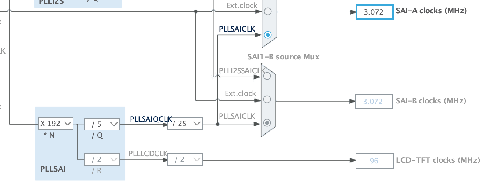

# Acquisition 

- [Acquisition](#acquisition)
  - [PDM](#pdm)
  - [SAI](#sai)
  - [DMA](#dma)
  - [Pratique](#pratique)

## Le PDM 

Le PDM (_Pulse-Density modulation_) soit modulation par densité d'impulsions est utilisé pour réprésenter un signal analogique en signal binaire. Le principe est le suivant, on a un signal audio sous sa forme analogique que l'on va chercher à enregistrer. Pour cela, on va coder chaque échantillon du signal sur un seul bit. Chaque échantillon est quantifiée à une valeur. Si l'échantillon (postion n) à une valeur inférieure à léchantillon précédent (position n-1) alors son bit sera codé à 0, sinon si sa valeur est supérieure alors son bit sera codé à 1. C'est donc une comparaison à chaque instant d'échantillonage avec le précédent qui permettra de moduler notre signal audio. Cette méthode à un nom, la modulation Delta. 

Pour mieux visualiser, voici un schéma explicatif :


## SAI

Le SAI (_Serial Audio Interface_) est une interface permettant au microcontrôleur de communiquer avec plusieurs dispositifs audio externes dont les microphones. Sur le STM32, le SAI a une interface PDM dédiée, ce qui permet directement d'acquérir un signal audio en entrée. Pour notre projet, c'est donc cette interface qui nous intéresse. Si on veut acquérir un signal audio, il faut donc que notre microphone soit connecté au SAI en configuration mono et mode de réception maître. 

Voici le schéma de connection d'un microphone en mode mono sur l'interface SAI :


La broche nommée _LR_ sur le schéma ci-dessus est une broche de sélection de canal du microphone qui peut être connectée soit à Vdd, soit à GND. En fonction du canal selectionné, on choisit si le microphone émet les données sur les fronts montants ou descendant de l'horloge. Le front d'échantillonnage de l'horloge SAI doit être configuré en conséquence. Selon la documentation (voir ci-dessous), on a le choix entre 16 KHz ou 48 KHz pour _Fe_, nous avons fait le choix de 48 KHz puisque cela nous induit une meilleure qualité audio. Le front d'échantillonage de l'horloge SAI sera donc de 3.072 MHz. 


 
Les échantillons audio en entrée sont acquis par broche de sortie de données (DOUT) du microphone numérique via la broche de données série (SD), sur le schéma ci-dessous on voit que c'est la sortie PE6. 


## DMA

Le DMA (_Direct Memory Access_) soit accès direct à la mémoire permet de stocker directement des données venant d'un périphérique en mémoire principale de la machine. C'est à dire que le microprocesseur n'intervient pas lors du transfert. La conclusion du transfert de donnée peut être signalée par interruption, cela sera utile dans le cas de notre projet. Le DMA est surtout utile quand on travail avec de grandes quantités de données, le processeur peut rapidement être ralenti si tous les octets doivent passer par l'unité centrale. L'utilisation du DMA permettra donc de transférer des données sans qu'aucun code ne soit exécuté.


Voici un schéma explicatif pour mieux comprendre le principe du DMA : 

Schéma simplifié d'un transfert de mémoire dans un microprocesseur


Schéma d'un transfert de mémoire avec l'aide du DMA 


 Pendant que les données sont transférées avec le DMA, l'unité centrale peut travailler sur d'autres choses. En effet, étant donné que le signal audio est lourd, il est essentiel de traiter les données en même temps que de les passer en mémoire. On va donc procéder de la manière suivante, le tableau de donnée renseigné à partir du SAI va être scindé en deux parties, la partie MSB et LSB. On verra dans la prochaine section comment traiter ces deux parties.  


## Pratique 

Dans cette partie on va voir dans un premier temps la configuration de l'horloge et du SAI en mode DMA et dans un second temps le code implémenté pour la réception via le SAI en mode DMA. 

Configuration horloge du SAI 



Configuration du SAI 


Configuration du DMA lié au SAI 


Code pour l'acquisition du signal audio 

```c

#define PDM_DATA_SIZE 8
#define PDM_NB_SAMPLE_BY_FRAME PDM_FRAME_LENGHT/PDM_DATA_SIZE
#define NB_FRAME_IN_PDM_BUFFERSIZE 20
#define PDM_BUFFERSIZE PDM_NB_SAMPLE_BY_FRAME*NB_FRAME_IN_PDM_BUFFERSIZE

uint8_t pdmBuffer[PDM_BUFFERSIZE];

HAL_SAI_Receive_DMA(&hsai_BlockA1, (uint8_t *)pdmBuffer, PDM_BUFFERSIZE/2);
HAL_TIM_Base_Start(&htim2);

```


