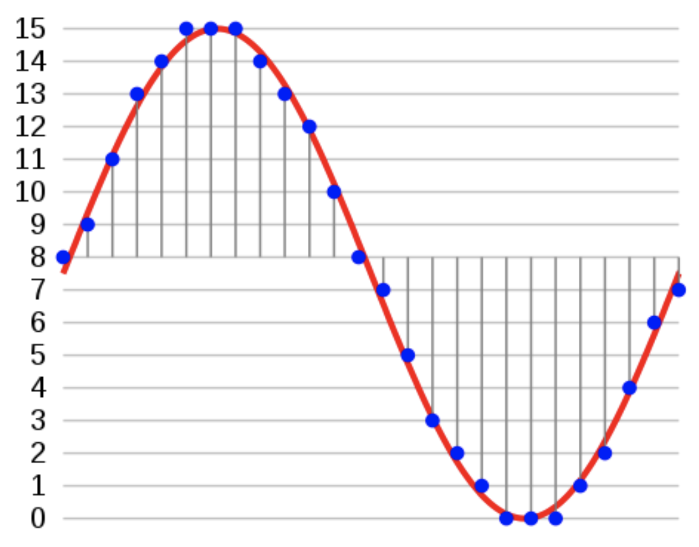
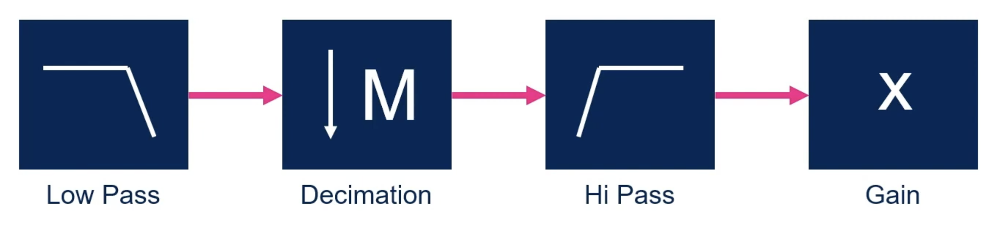
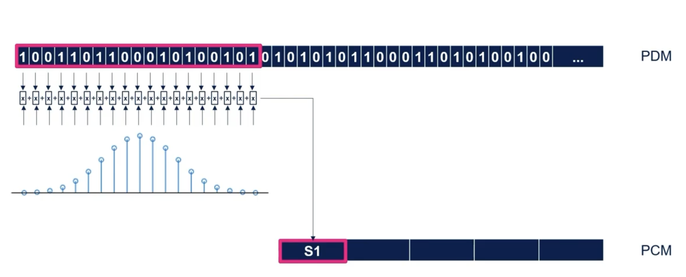
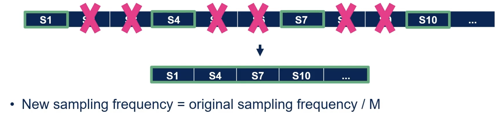
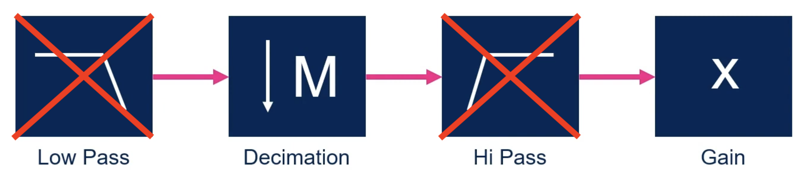
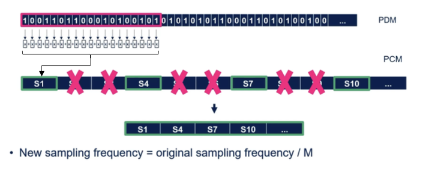

# Conversion des données PDM &rarr; PCM 

## Le PCM

Le PCM (_Pulse Code With Modulation_), est un signal numérique produit à la suite d'une chaîne d'opération: Échantillonnage, quantification et codage. \
Comme on peut le constater sur la figure suivante le signal est échantilloné à une fréquence _fe_ et chaque échantillon représente une impulsion à une certaine amplitude.




Si l'on compare l'allure d'un signal _PDM_ à celle d'un signal _PCM_, on remarque 2 différences principales:
1. La fréquence d'échantillonnage du signal _PDM_ est plus importante que celle du signal _PCM_
2. Le signal _PDM_ possède des amplitudes binaires (0-1) alors que l'amplitude du _PCM_ est numériques.


# Conversion 
## Conversion selon STM

Ils existes plusieurs solutions, pour réaliser une conversion _PDM_ vers _PCM_. Selon la documentation de _STM32_ il est conséillé de suivre la procédure suivante :



Il faut dans un premier temps utilisé un filtre passe-bas pour convertir les données _PDM_ en _PCM_. La convertion ce fait grâce à un filtre FIR, l'objectif est de multiplier les 
échantillon PDM par les coéficient du filtre et de faire une somme pondéré. Au final on se retrouve avec des données numériques, c'est à dire un signal _PCM_



Ce filtre permet également de réduir la fréquence d'échantillonage, mais insuffisament. Pour obtenir la fréquence d'échantillonage du _PCM_ il faut procéder à une décimation, avec un facteur de décimation approprié.



## Notre conversion

Dans le cas du projet, nous avons simplifié la conversion. Nnous allons simplement réaliser une décimation. Une décimation tout de même un peu particulière puisqu'en plus de décimé notre signal on va convertir nos bits en données numériques, c'est à dire en _PCM_.



Comme expliqué précédement le _PDM_ est configuré à une fréquence d'échantillonage de _3.072 MHz_, ce qui est beaucoup plus important que la fréquence cible du _PCM_ qui est de _48kHz_. L'objectif est donc de réduire la fréquence du signal _PDM_. \
La décimation permet de réduire la fréquence d'échantillonage d'un signal en prenant seulement un échanitillon tous les n-échantillons: 


C'est donc idéal pour notre cas d'utilisation. \
Pour déterminer le facteur de décimation on peut appliquer la formule de la figure précédente. Après calcul on trouve un facteur de décimation de 64. Si on prend donc 1 échantillon PDM tout les 64 échantillons on obtiendra un signal avec une fréquence de _48kHz_. \
Seulement, prendre 1 échantillon tout les n-échantillons, permet uinquement de réduire la fréquence d'échantillonage du signal, pas de convertir en PDM &rarr; PCM. On va donc compter tous les bits à 1 dans une trame de 64 bits, ce qui nous permettra d'obtenir une valeur entre 0 et 64. 
Au final on obtiendra un signal _PCM_ avec un certain nombres d'impulsions, des amplitudes situé entre 0 et 64 avec une fréquence d'échantillonage de _48kHz_.





## Mise en pratique 

### Variables

Nous avons besoins d'un certains nombre de variables. 
1. Le `pdmBuffer` présenter à la partie précédente qui contient les valeurs _PDM_ du DMA
2. Le `pcmBuffer`, il contiendra les données pcm convertis d'un demi DMA 
3. le `pcmData`, il contiendra toutes les données pcm convertis. 
   
```c
#define NB_FRAME_IN_PDM_BUFFERSIZE 20
#define PDM_BUFFERSIZE PDM_NB_SAMBLE_BY_FRAME*NB_FRAME_IN_PDM_BUFFERSIZE
#define PCM_BUFFERSIZE NB_FRAME_IN_PDM_BUFFERSIZE/2

#define PCM_SAMPLING_RATE 48000
#define NB_SEC_OUTPUT 1
#define PCM_NB_SAMPLE (NB_SEC_OUTPUT*PCM_SAMPLING_RATE)

uint8_t pdmBuffer[PDM_BUFFERSIZE];
uint32_t pcmBuffer[PCM_BUFFERSIZE];
uint32_t pcmData[PCM_NB_SAMPLE];
```

### Lecture du DMA
Comme expliqué dans la partie de [l'acquisition](../acquisition/acquisition.md), nous travaillons en demi DMA pour des soucis de stockage et de conversion en temps réel. Quand un demi DMA est plein, les données PDM sont disponible pour être convertis en PCM. \
Il faut donc savoir qu'elle partie du DMA est plein pour procédé à la conversion. 

STM nous donne accès à deux fonctions d'interruptions que l'on peut modifier pour mettre des flags à 1.
1. Une intérruption pour déterminer si la moitié du DMA est plein: \
   `void HAL_SAI_RxHalfCpltCallback(SAI_HandleTypeDef *hsai)`
2. Une intérruption pour déterminer si le DMA est plein: \
   `void HAL_SAI_RxHalfCpltCallback(SAI_HandleTypeDef *hsai)`

Grâce à c'est fonction on peut facilement déterminer qu'elle partie du DMA est pleine et doit être convertis en PCM.


```c
while (recording){
	if(dmaLSBFull || dmaMSBFull){ // si l'une des moitié du DMA est pleine
			if (dmaMSBFull){ 
				dmaMSBFull = 0; // remise à 0 du flag
				pdm2pcm((uint8_t*)(pdmBuffer+PDM_BUFFERSIZE/2), pcmBuffer);
			}
			else {
				dmaLSBFull = 0;
				pdm2pcm(pdmBuffer, pcmBuffer);
			}
	}
}
```

Chaque interrupion on execute la fonction de conversion `pcm2pdm` avec en premier argument les donnés pdm (données dans le DMA) à convertir et en deuxième argument un tableau vide qui va nous permettre
de récuperer les données pcm convertis. \
C'est dans le permiers argumets, où l'on donne le tableau des valeurs pdm qu'il faut spécifier sur qu'elle moitié du DMA on va travaillé. 
1. Si c'est la première moitié, il suffit de lui donné le tableau `pdmBuffer` en entier. C'est à dire que si notre tableau est de longueur 100, alors on commence à l'élement 0 et dans notre fonction on ira jusqu'à l'élément 49. 
2. Si c'est la seconde moitié, alors on donne le tableau `pdmBuffer+PDM_BUFFERSIZE/2`, c'est à dire que si notre tableau est de longueur 100, alors on commence à l'élement 50 et dans notre fonction on ira jusqu'à l'élément 99. 


### Conversion des données

Il est important de noter que dans la partie [acquisition](../acquisition/acquisition.md), nous avons configurer le _SAI_ avec une longuer de frame de 64 bits et un type de données sur 8 bits. Nos valeurs dans le dma sont donc sur 8 bits. Nous on souhaite faire la somme du nombre de bit à 1 dans une frame (64-bits), pour cela on va créer un pointeur sur 64 bits vers notre tableau de 8 bits qui contient les données _PDM_: `uint64_t* pdmFrameBuffer = pdmBuffer;` 
Maintenant que l'on à un pointeur de 64-bits sur notre tableau de 8-bits, on peut parcourire tout les frames de notre acquisition à l'ai d'une boucle `for`. \

Pour compter les bits à 1 on utilise une fonciton integré au compilateur: `__builtin_popcount`, cela nous permet donc d'obtenir une valeur entre 0 et 64. Chaque frame de 8 échantillon _PDM_ ce retrouve réduit à 1 échantillon _PCM_.

```c
void pdm2pcm(uint8_t* pdmBuffer, uint32_t* pcmBuffer){
	uint64_t* pdmFrameBuffer = pdmBuffer;


	for (int frameNbr=0; frameNbr<NB_FRAME_IN_PDM_BUFFERSIZE/2; frameNbr++){
		pcmBuffer[frameNbr] = (uint32_t)__builtin_popcount(pdmFrameBuffer[frameNbr]);
	}
}
```


### Arrêt de l'enregistrement

Les données d'un demi DMA sont maintenant convertissable à l'aide de notre fonction, mais il reste un problème. Il faut stocker c'est valeurs PCM. \
Pour cela on à un tableau `pcmData` qui à une longeur de 48 000 échantillons, soit 1 seconde d'enregistrement avec une fréquence d'échantillonnage de 48kHz. A chaque fois que l'on obtient de nouvelles données PCM à la suite d'une conversion, il faut ajouter les données de `pcmBufer` dans `pcmData`. \
Si `pcmData` est plein, dans ce cas il faut arrêter l'enregistrement.

Ce qui nous permet d'avoir le code suivant:

```c
while (recording){
	if(dmaLSBFull || dmaMSBFull){ // si l'une des moitié du DMA est pleine
			if (dmaMSBFull){ 
				dmaMSBFull = 0; // remise à 0 du flag
				pdm2pcm((uint8_t*)(pdmBuffer+PDM_BUFFERSIZE/2), pcmBuffer);
			}
			else {
				dmaLSBFull = 0;
				pdm2pcm(pdmBuffer, pcmBuffer);
			}

		// ajout des données pcm convertis aux données finale
		for(int i = 0; i<PCM_BUFFERSIZE; i++){
			pcmData[pcmDataIndex]=pcmBuffer[i];
			pcmDataIndex++;
			if(pcmDataIndex >= PCM_NB_SAMPLE){
				recording = 0;
				HAL_SAI_DMAStop(&hsai_BlockA1);
			}
		}
	}
}
```