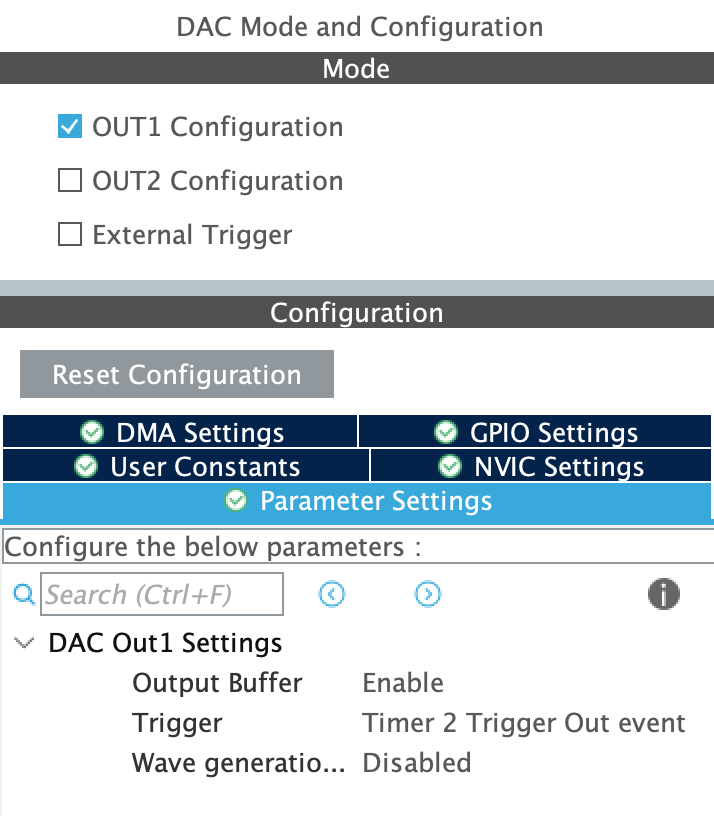
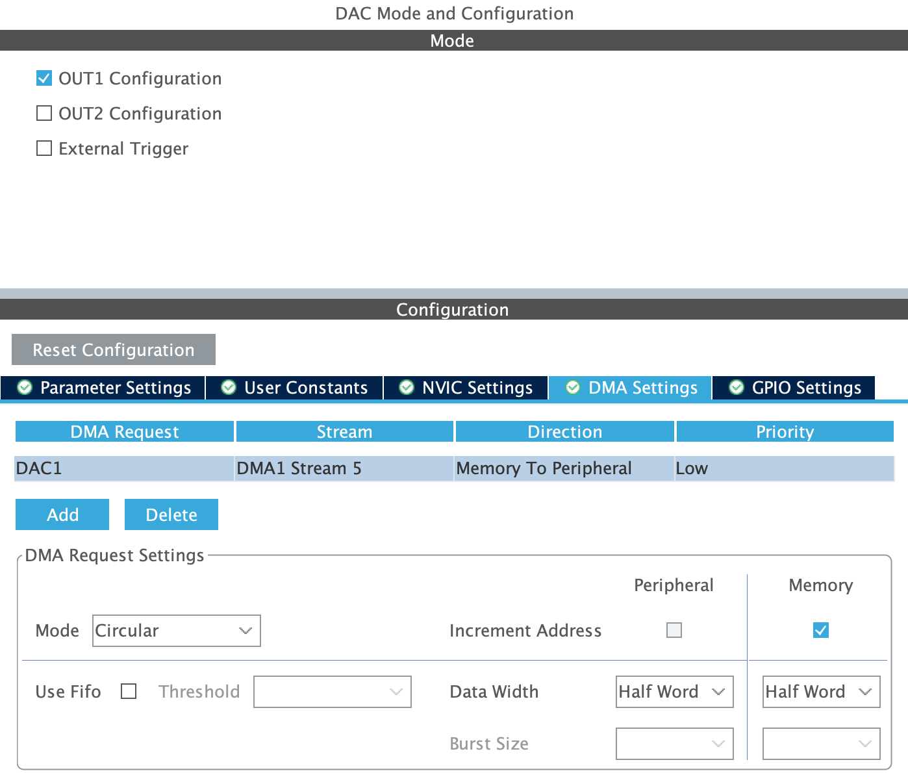
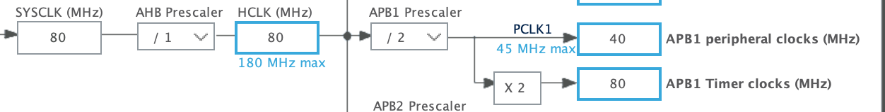
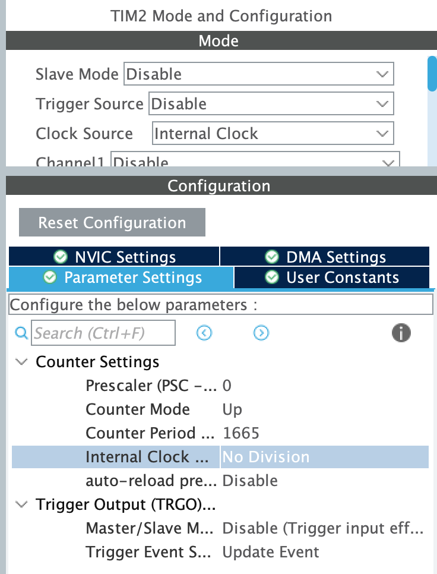

# Diffusion

La dernière étape de notre chaine de traitement consiste à diffuser le son enregistré précédemment dans la mémoire de notre STM32. Pour ce faire, nous devons piloter le DAC via le DMA et générer le signal vers une sortie audio, casque, haut-parleurs... 

## DAC

Le DAC ou Digital-to-Analog Converter est un composant matériel qui permet de convertir des signaux numériques en signaux analogiques. Sur une STM32, il peut être utilisé pour produire des signaux analogiques pour des applications telles que la génération de formes d'onde, la synthèse audio, le contrôle de moteurs, etc.

Le DAC peut être configuré pour fonctionner avec différentes résolutions (8, 10, 12 bits), des tensions de référence internes ou externes, et des modes de sortie de signal (unipolaire ou bipolaire). 

## Amplification du signal PCM

Le signal de sortie peut être amplifié pour rehausser le signal. On utilise un amplificateur en spécifiant un gain. Pour déterminer ce dernier, on s'appuie sur la partie décimation. Nous avons déterminé précédemment un facteur décimation de 64, donc nos échantillons on une valeur allant de 0 à 64. Or le DAC a une résolution fixée à 12 bits ce qui impose une valeur entière max de 4096. On peut donc déterminer la valeur max du gain par le calcul suivant.

$$ Gain_{max} = \frac{4096}{64} = 64$$

## Mise en pratique

### Configuration du DAC

On configure le DAC sur la carte en choisissant une sortie, par exemple OUT1 indiquant la pin PA4. Dans notre cas nous activons aussi le DMA et un timer, et un bouton pour jouer le signal enregistré.

<p align="center">
  
  
</p>

Nous avons configuré notre SAI pour une acquisition d'un signal sonore avec une _fe_ de 48 kHz, il est donc nécessaire de conserver cette configuration et de la reproduire pour le DAC. 

$$ (PSC+1)(ARR+1)=\frac{CLK_{freq}}{OutputFrequency}=\frac{80MHz}{48kHz}=1666.66$$

Après calcul, si on choisis une fréquence de 80Mhz, il nous faut un _Auto Reload Register_ de 1665 et un _Prescaler_ de 0 pour obtenir une fréquence d'échantillonage de 48kHz



<p align="center">
  
</p>


### Ajout de l'amplification

Avant de générer le signal, nous avons fait le choix de l'amplifier en fixant la valeur de gain à 80, qui est un bon compromis pour rehausser le niveau du signal en minimisant la saturation.

```c
for (int i = 0; i < PCM_NB_SAMPLE; i++){
 	  pcmData[i] = pcmData[i] * GAIN;
   }
```

### Ajout dans le code

Dans la boucle While du code, on ajoute la condition pour jouer l'enregistrement.

```c
/* USER CODE BEGIN WHILE */
  while (1)
  {
	  if (HAL_GPIO_ReadPin(GPIOA, GPIO_PIN_0)){
		  HAL_DAC_Start_DMA(&hdac, DAC_CHANNEL_1, (uint32_t*)pcmData, PCM_NB_SAMPLE, DAC_ALIGN_12B_R);
		  HAL_Delay(NB_SEC_OUTPUT*1000);
		  HAL_DAC_Stop_DMA(&hdac, DAC_CHANNEL_1);
	  }
	  HAL_Delay(500);
    /* USER CODE END WHILE */
  }
```

Si l'utilisateur appuie sur le bouton pin0 de la carte, on lance la diffusion du signal avec la fonction `HAL_DAC_Start_DMA()`. En paramètre, on a renseigné le channel, la data, le nombre d'échantillons et la résolution de notre DAC.

Le signal se joue sur `HAL_Delay(NB_SEC_OUTPUT*1000);`, ce qui représente la durée du signal enregistré avant de se couper avec la fonction `DAC HAL_DAC_Stop_DMA()`.


