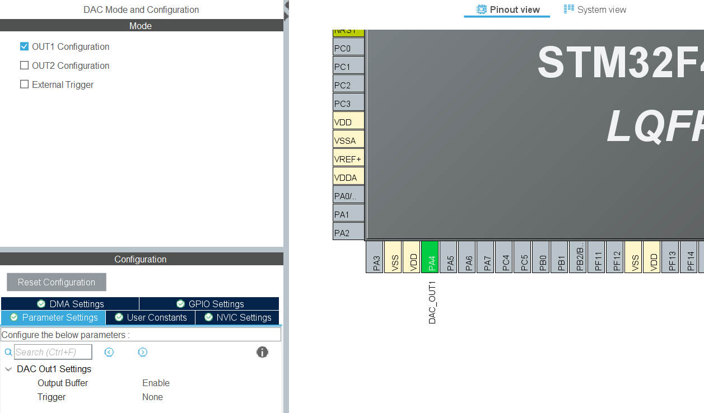

# Diffusion

La dernière étape de notre chaine de traitement consiste à diffuser le son enregistré précédemment dans la mémoire de notre STM32. Pour ce faire, nous devons piloter le DAc via le DMA et générer le signal vers une sortie audio, casque, hauts-parleurs... 

## Methodes utilisation du DAC

Le DAC ou Digital-to-Analog Converter est un composant matériel qui permet de convertir des signaux numériques en signaux analogiques. Sur une STM32, il peut être utilisé pour produire des signaux analogiques pour des applications telles que la génération de formes d'onde, la synthèse audio, le contrôle de moteurs, etc

Le DAC peut être configuré pour fonctionner avec différentes résolutions (8, 10, 12 bits), des tensions de référence internes ou externes, et des modes de sortie de signal (unipolaire ou bipolaire). 

## Methodes amplificateur

Le signal de sortie peut être amplifié pour améliorer la qualité sonore. On utilise un amplificateur en spécifiant un gain. Toutefois il est nécessaire de veiller à ne pas dépasser la limite, sous peine de saturer l'amplificateur.

## Mise en pratique

Pour utiliser le DAC sur la carte STM32 on réalise deux étapes clés :

### Configuration du setup

On configure le DAC sur la carte en choisissant une sortie, par exemple OUT1 indiquant la pin PA4. Dans notre cas nous activons aussi le DMA et un timer, et un bouton pour jouer le signal enregistré,



Une fois la configuration enregistré, nous pouvons générer le code.

### Ajout de l'amplification

Avant de générer le signal, nous avons fais le choix de l'amplifier en fixant la valeur de gain à 80, valeur limite pour éviter la saturation de l'ampli. De cette manière on réhausse le niveau du signal.

```
for (int i = 0; i < PCM_NB_SAMPLE; i++){
 	  pcmData[i] = pcmData[i] * GAIN;
   }
```

### Ajout dans le code

Dans la boucle While du code, on ajoute la condition pour jouer l'enregistrement.
```
/* USER CODE BEGIN WHILE */
  while (1)
  {
	  if (HAL_GPIO_ReadPin(GPIOA, GPIO_PIN_0)){
		  HAL_DAC_Start_DMA(&hdac, DAC_CHANNEL_1, (uint32_t*)pcmData, PCM_NB_SAMPLE, DAC_ALIGN_12B_R);
		  HAL_Delay(NB_SEC_OUTPUT*1000);
		  HAL_DAC_Stop_DMA(&hdac, DAC_CHANNEL_1);
	  }
	  HAL_Delay(500);
    /* USER CODE END WHILE */
```

Si l'utilisateur appuie sur le bouton pin0 de la carte, on lance la diffusion du signal avec la fonction "HAL_DAC_Start_DMA()". En paramètre, on a renseigné le channel, la data, le nombre d'échantillons et la résolution de notre DAC.

Le signal se joue sur "HAL_Delay(NB_SEC_OUTPUT*1000);"  soit une seconde, ce qui représente la limite de la durée du signal stockable.

Enfin, une fois le signal joué on stoppe le DAC à l'aide de la fonction "DAC HAL_DAC_Stop_DMA()".


