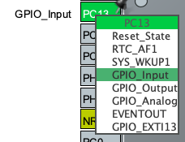

# Clignotement d'une led avec un boutton

> *On considére que la configuration de la led à déjà était faite avec l'exemple 'toggle_led'*


### Configuration de la pin connecté au BP


### Modification du code
```c
/* USER CODE BEGIN WHILE */
while (1)
{
    if (HAL_GPIO_ReadPin(GPIOC, GPIO_PIN_13)) {
        HAL_GPIO_WritePin(GPIOA, GPIO_PIN_5, 1);
    }
    else {
        HAL_GPIO_WritePin(GPIOA, GPIO_PIN_5, 0);
    }
    HAL_Delay(100);

    /* USER CODE END WHILE */
}
```
