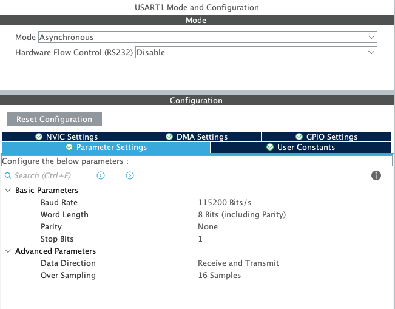

# UART - Affichage d'un message à l'appui du bouton

> *On considère que la configuration de la LED et du BP à déjà était faite avec l'exemple 'pushbutton_led'*


### Configuration de l'UART


### Modification du code
```c
/* USER CODE BEGIN 2 */
uint8_t *tx;
uint8_t cnt = 0;
/* USER CODE END 2 */

/* Infinite loop */
/* USER CODE BEGIN WHILE */

while (1)
{
    if (HAL_GPIO_ReadPin(GPIOC, GPIO_PIN_13)) {
        HAL_GPIO_WritePin(GPIOA, GPIO_PIN_5, 0); // led
    }
    else {
        HAL_GPIO_WritePin(GPIOA, GPIO_PIN_5, 1); // led

        cnt++;
        sprintf(tx, "You have push the BP for the %d time\r\n", cnt);
        HAL_UART_Transmit(&huart1, tx, sizeof(tx), 100);
    }
    HAL_Delay(200);

/* USER CODE END WHILE */

/* USER CODE BEGIN 3 */
}
```
