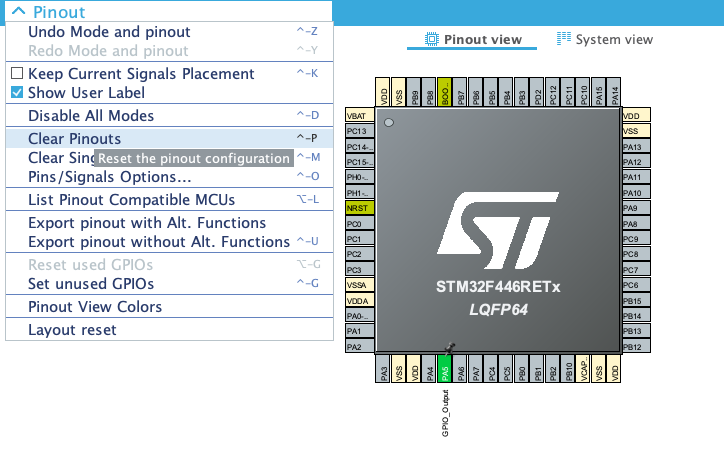
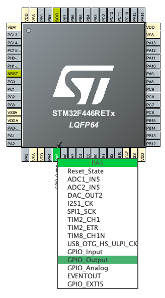

# Clignotement d'une led 

### Préparation du projet


### Configuration de la pin connecté à la LED


### Modification du code
```c
/* USER CODE BEGIN WHILE */
while (1)
{
    HAL_GPIO_TogglePin(GPIOA, GPIO_PIN_5);
    HAL_Delay(1000);

    /* USER CODE END WHILE */
}
```
