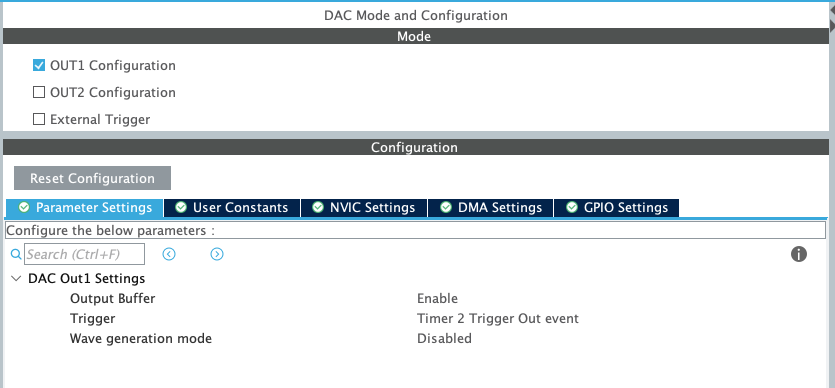
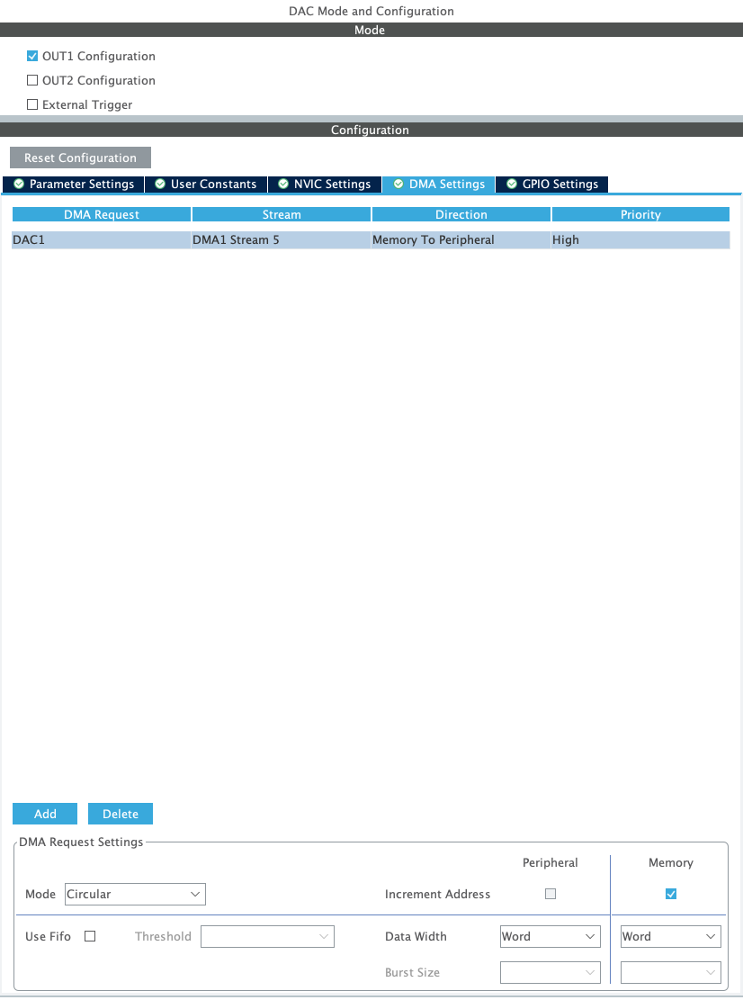
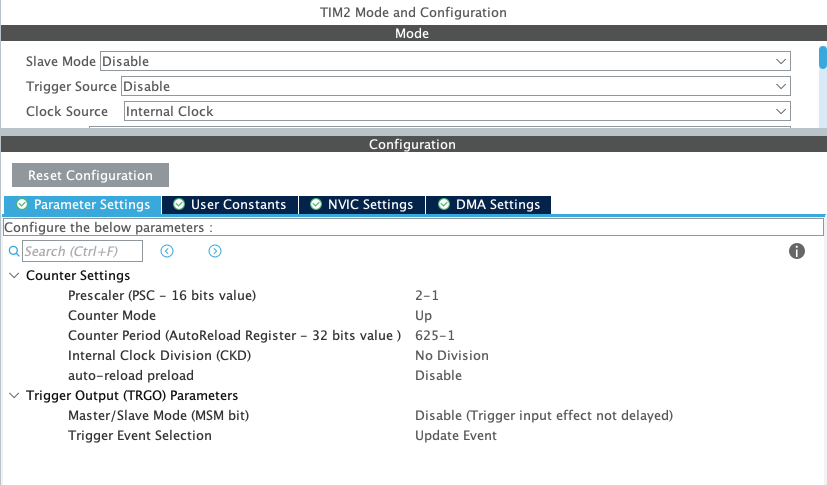
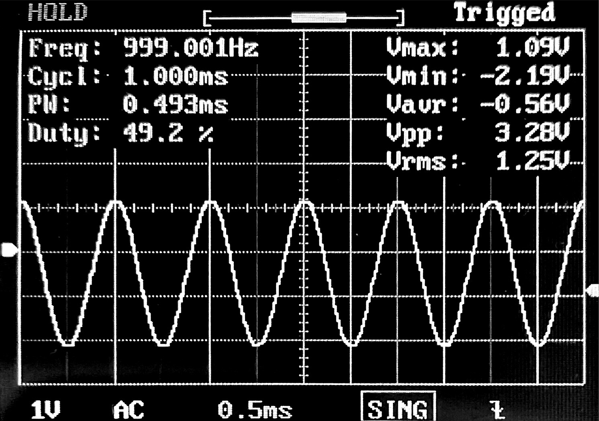
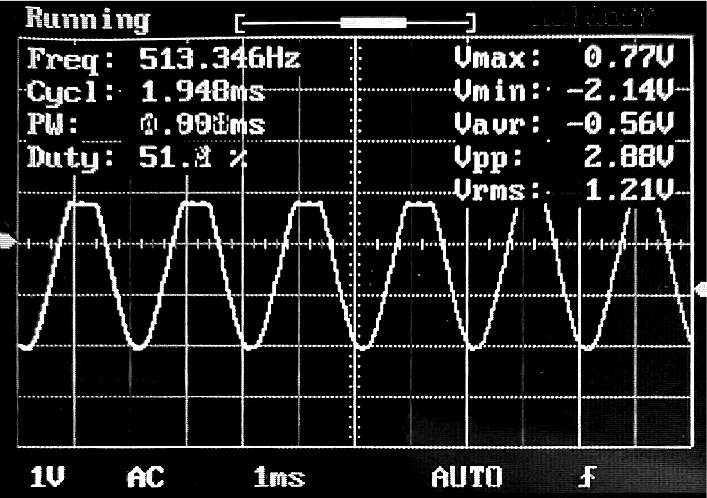

# Génération d'un signal de 1Khz

### Configuration du DAC



On configure en plus le DMA qui sera associé au DAC



### Configuration du Timer




Pour choisir les paramétres du timers pour une fréquence voulu on peut appliquer les formules suivantes :

$$ TriggerFrequency = OutputWaveFrequency * Ns$$ 

avec _Ns_ le nombre de sample de notre signal

$$ (PSC+1)(ARR+1) = \frac{F_{CPU}}{TriggerFrequency}$$

#### Exemple: _Pour un sinus avec une lookup table de 128 samples_

__Si l'on souhaite une freq de 1Khz:__
   
$$ TriggerFrequency = OutputWaveFrequency * Ns = 1.10^3 * 128 = 128.10^3$$ 

$$ (PSC+1)(ARR+1) = \frac{F_{CPU}}{TriggerFrequency} = \frac{80.10^6}{128.10^3} = 625$$

On peut donc choisir un prescaler de 0 est un période de 625.



__Si l'on souhaite une freq de 500Hz:__
   
$$ TriggerFrequency = OutputWaveFrequency * Ns = 500 * 128 = 64.10^3$$ 

$$ (PSC+1)(ARR+1) = \frac{F_{CPU}}{TriggerFrequency} = \frac{80.10^6}{64.10^3} = 1250$$

On peut donc choisir un prescaler de 0 est un période de 1250. On sait que 1kHz c'est deux fois 500Hz. Au lieu de refaire le calcul on aurait simplement aussi pu garder une période de 625 et ajouter un prescaler de 2.




### Code 

```c
  /* USER CODE BEGIN 2 */
  uint32_t Wave_LUT[128] = {
      2048, 2149, 2250, 2350, 2450, 2549, 2646, 2742, 2837, 2929, 3020, 3108, 3193, 3275, 3355,
      3431, 3504, 3574, 3639, 3701, 3759, 3812, 3861, 3906, 3946, 3982, 4013, 4039, 4060, 4076,
      4087, 4094, 4095, 4091, 4082, 4069, 4050, 4026, 3998, 3965, 3927, 3884, 3837, 3786, 3730,
      3671, 3607, 3539, 3468, 3394, 3316, 3235, 3151, 3064, 2975, 2883, 2790, 2695, 2598, 2500,
      2400, 2300, 2199, 2098, 1997, 1896, 1795, 1695, 1595, 1497, 1400, 1305, 1212, 1120, 1031,
      944, 860, 779, 701, 627, 556, 488, 424, 365, 309, 258, 211, 168, 130, 97,
      69, 45, 26, 13, 4, 0, 1, 8, 19, 35, 56, 82, 113, 149, 189,
      234, 283, 336, 394, 456, 521, 591, 664, 740, 820, 902, 987, 1075, 1166, 1258,
      1353, 1449, 1546, 1645, 1745, 1845, 1946, 2047
  };

  HAL_DAC_Start_DMA(&hdac, DAC_CHANNEL_1, (uint32_t*)Wave_LUT, 128, DAC_ALIGN_12B_R);
  HAL_TIM_Base_Start(&htim2);
  /* USER CODE END 2 */
```
