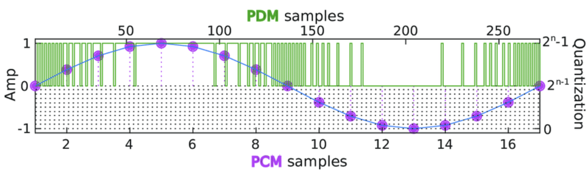
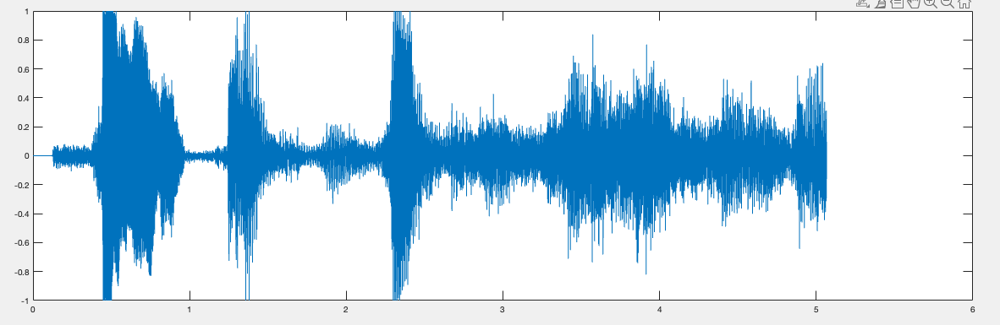
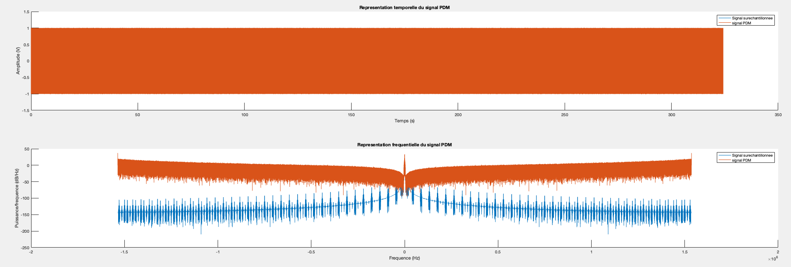
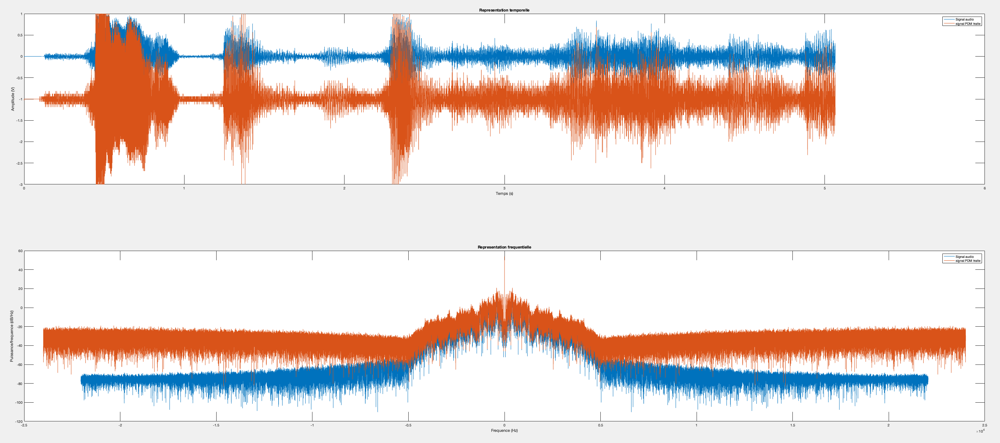
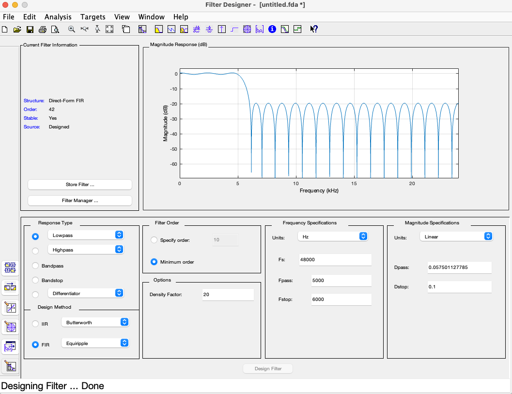
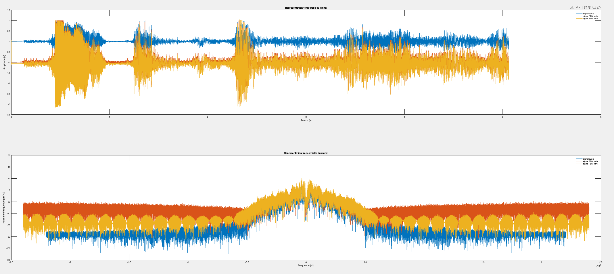
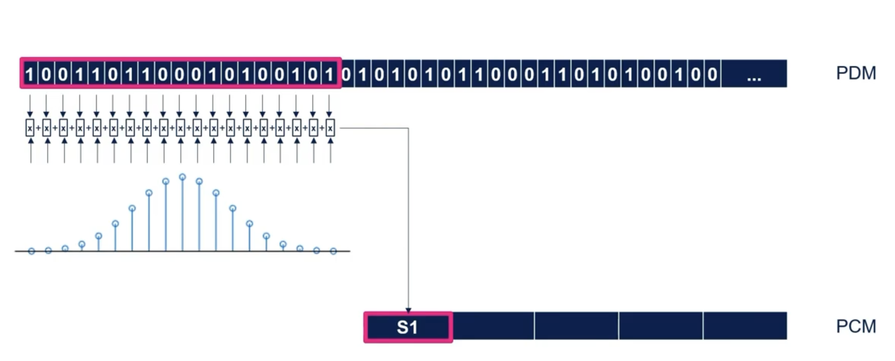
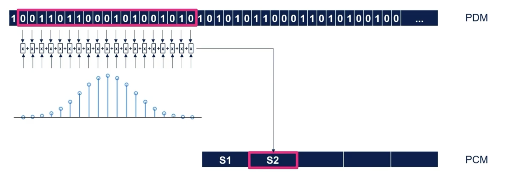

# Filtrage

Comme on peut le constater sur l'image suivante, un signal _PDM_ à une fréquence d'échantillonnage beaucoup plus importante qu'un signal _PCM_.



Réaliser une décimation pour réduire cette fréquence et convertir notre signal _PCM_ permet d'obtenir un signal audible, mais pas parfait. Dans un premier temps on peut constater qu'il y aura une perte de certaine information, mais le principal problème problème et la conservation de certaine de c'est haute fréquence qui peuvent causer du bruit ou encore une qualité type talki-walki. 

L'objectif de cette partie consiste donc à obtenir un signal de meilleure qualité, mais pour ce faire il est important de comprendre correctement les étapes pour procéder au filtrage à l'aide de Matlab.

## Les effets d'un signal PDM

C'est étapes ne seront pas directement liées à notre projet, nous allons partir d'un enregistrement audio et nous allons le convertir en _PDM_ pour comprendre les effets de cette modulation et comment les réduire.


### Lecture d'un signal audio

Dans un premier temps nous devons lire ce signal audio. On pourra également extraire certaines données essentielles qui pourront nous servir pour la suite.

```c
[x, fs] = audioread('bond.wav');

Ts = 1/fs;
N = length(x);
t = [0:Ts:(N-1)*Ts];
duree = N/fs
```




### Conversion du signal audio vers un signal PDM

Il est nécessaire de réchantillonner notre signal. La fréquence actuelle ne correspond pas à celle que l'on utilise dans notre projet, une fréquence de _3.072MHz_.

```c
fs_new = 3.072e6; 

x_resampled = resample(x, fs_new, fs);
```

<br>

Une fois qu'on a la bonne fréquence, on peut réaliser une modulation PDM à l'aide d'une fonction que nous avons réalisée, cette fonction est inspirée de l'algorithme donné par [Wikipédia](https://en.wikipedia.org/wiki/Pulse-density_modulation). 

```c
function result = modulation_PDM(s, qe)
    s_mod = zeros(1, length(s));
    for i = 1:length(s)
        qe = qe + s(i);

        if qe > 0 
            s_mod(i) = 1;
        else
            s_mod(i) = -1;
        end
        qe = qe - s_mod(i);
    end
    result = s_mod;
 end 
```

```c
x_mod = modulation_PDM(x_resampled, 0);
```



- Orange &rarr; Signal PDM
- Bleu &rarr; Signal Audio suréchantillonnée

On remarque facilement que le signal PDM à majoritairement des hautes fréquences comparées au signal audio suréchantillonnée. De plus on ne reconnaît même plus notre allure temporelle que nous avions précédemment.


### Traitement du signal PDM

Dans notre projet, nous avons utilisé une décimation pour réaliser la conversion PDM &rarr; PCM. Ici on va optimiser ce processus que nous avons simplifié, à l'aide d'un filtre passe-bas. On remarque au final que nous allons réaliser ce qui est préconisé par STM (cf [conversion](../conversion/conversion.md)). 

Pour ce faire, on va utiliser un filtre passe-bas à moyenne glissante sur 64 points ainsi que d'un sous échantillonnage avec un facteur de 64, ce qui correspond également au facteur décimation que nous avons utilisé dans notre projet.

$$ \frac{3.072MHz}{64} = 48kHz$$

On procède donc au filtrage de la manière suivante:

```c
nb_points = 64;
ech_factor = 64;

filtre = ones(1, nb_points)/ech_factor;
x_filtered = filter(filtre, 1, x_mod);
```



- Orange &rarr; Signal PDM traité
- Bleu &rarr; Signal Audio

Grâce au filtre nous avons retrouvé l'allure de notre signal audio, mais la représentation fréquentielle démontre que nous avons toujours une présence importante des hautes fréquences. Comme expliqué plusôt, c'est les hautes fréquences obtenues à la suite de notre décimation qui réduise la qualité de notre signal. On constante donc que c'est dernier sont bel et bien présente, l'objectif va donc être de les filtrer.


### Filtrage d'un signal PDM

À présent l'objectif est donc de supprimer les composantes fréquentielles haute-fréquence du signal. Pour ce faire nous allons utiliser un filtre passe-bas.

#### Design du filtre

Nous allons utiliser les données précédemment obtenues suite aux analyses pour designer notre filtre à l'aide de l'outil Matlab: _filterDesigner_



Cet outil nous aide dans la création du filtre pour vérifier si nos paramètres sont bons, mais également pour générer le code associé. Ce code nous permettra de filtrer notre signal _PDM_

```c
function coeffs_fir = createFIRFilter

Fs = 48000; 

Fpass = 5000;         
Fstop = 6000;           
Dpass = 0.057501127785; 
Dstop = 0.1;           
dens  = 20;          

[N, Fo, Ao, W] = firpmord([Fpass, Fstop]/(Fs/2), [1 0], [Dpass, Dstop]);

b  = firpm(N, Fo, Ao, W, {dens});
Hd = dfilt.dffir(b);
coeffs_fir=Hd.Numerator;
```

#### Utilisation du filtre

Le principe est le même qu'avec le premier filtre, mais cette fois-ci il faut faire appel à notre fonction précédemment créée

```c
fir_filter = createFIRFilter();
x_filtered_2 = filter(fir_filter, 1, x_filtered);
```



- Orange &rarr; Signal PDM traité
- Bleu &rarr; Signal Audio
- Jaune &rarr; Signal PDM filtré

On remarque facilement les effets du filtre, nous avons supprimé les hautes fréquences provenant du signal PDM tout en préservant l'allure du signal audio. Si on écoute les trois audios, une nette amélioration est à noter. 


## Filtrage de notre signal PCM 

Maintenant que nous avons calculé un filtre qui permet de filtrer les hautes fréquences provenant de notre signal PDM, nous pouvons reproduire ce code dans notre projet en utilisant les paramètres données par matlab. L'objectif est donc de réaliser le schéma suivant




Pour ce faire nous pouvons réaliser une fonction qui va nous permettre de calculer les coef du filtre FIR et une autre pour appliquer le filtre sur chaque échantillon PCM

```c
#define FILTER_CUTOFF_FREQUENCY 6000
#define FILTER_SAMPLING_FREQUENCY 48000
#define FILTER_NB_COEF 64

void calcFIR(float* FIRcoef, int nbCoef, float fc, float fe){
    float normalizedFc = 2.0f * PI * fc / fe;
    float sinc, hamming;
    for (int coefN = 0; coefN < nbCoef; coefN++) {
        if (coefN == (nbCoef-1)/2) {
        	FIRcoef[coefN] = normalizedFc / PI;
        } else {
            sinc = sinf(normalizedFc * (coefN - (nbCoef-1)/2)) / (PI * (coefN - (nbCoef-1)/2));
            hamming = 0.54f - 0.46f * cosf(2.0f * PI * coefN / (nbCoef-1));
            FIRcoef[coefN] = sinc * hamming;
        }
    }
}

void FIR(float* FIRcoef, int nbCoef, uint8_t* pcmData){
	for (int pcmIndex = 0; pcmIndex < PCM_NB_SAMPLE; pcmIndex++){
		float sum = 0;
		for(int nCoef = nbCoef; nCoef < nbCoef; nCoef++){
			sum += pcmData[pcmIndex+nCoef] * FIRcoef[nCoef];
		}
		pcmData[pcmIndex] = (uint32_t)sum;
	}
}
```

Un appel à nos fonctions nous permttront d'obtenir notre signal PCM filtré, les hautes fréquences seront donc retirées.

```c
float FIRcoef[FILTER_NB_COEF];
calcFIR(FIRcoef, FILTER_NB_COEF, FILTER_CUTOFF_FREQUENCY, FILTER_SAMPLING_FREQUENCY);
FIR(FIRcoef, FILTER_NB_COEF, pcmData);
```

> _Il est important de noter que nous n'avons pas pu tester cette dernière version de notre projet_