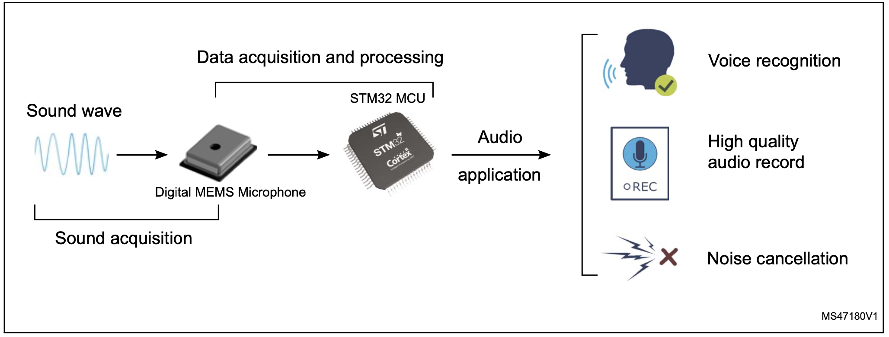
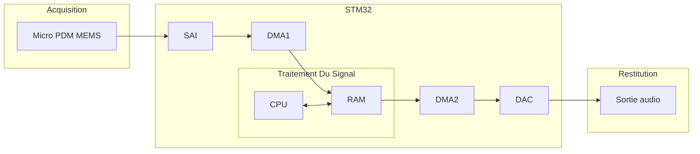
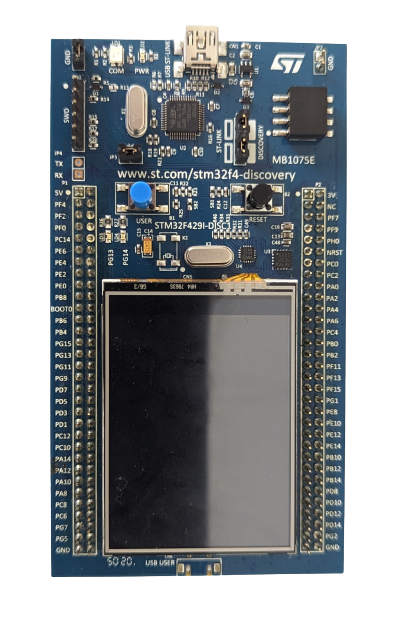
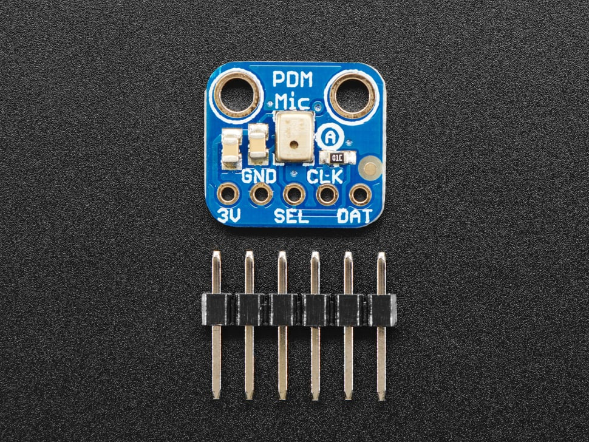

> Baptiste LE ROUX - Melvin DUBEE - Tanguy ROUDAUT

# Présentation

## Explication du projet

Au cours des 30 créneaux dédiés au projet il nous a été demandé d'enregistrer un son de quelques secondes sur la carte STM32 fournie via un micro MEMS et le rejouer sur des hauts-parleurs via le DAC.

Pour nous organiser et avancer progressivement vers le résultat final, nous avons commencé par apprendre les bases, que ce soit sur la configuration de la carte STM32, l'utilisation de composants et périphériques comme le DMA, le DAC etc, ou encore l'utilisation de Git.

Nous avons illustré notre apprentissage dans la rubrique [Exemples](../exemple/exemple.md), comme allumer une LED, afficher un message dans le moniteur série avec l'UART, générer un signal en sortie avec le DAC...

Après avoir atteint une certaine maitrise de ces différents aspects nous avons mis bout à bout nos connaissances en produisant la chaine complète du projet ci-dessous :

## Matériel

Pour mener à bien ce projet, nous avons utilisé :
- une carte _STM32F4290I-DISC1_
- un micro PDM _Adafruit 3492_
- une sortie Jack
- un casque

  
  

## Utilisation

#### Flashage de la carte

1. À partir de _CubeIDE_ : \
  Vous pouvez directement cloner notre dépôt puis l’ouvrir à l’aide CubeIDE. Si vous utilisez le même matériel dans ce cas aucun changement n’est nécessaire, il suffit de connecter la carte à votre pc via le périphérique ST-Link et de flasher la carte.

2. À partir des binaires : \
   Connecter la carte à votre pc via le périphérique ST-Link, ce qui devrait vous faire apparaitre un nouveau stockage. Si c’est le cas, il suffit de placer les binaires dans ce stockage comme si on le mettait sur une clé USB.

#### Enregistrement et diffusion

Une fois que la carte est flashée, l’enregistrement démarre automatiquement. Si vous n’avez pas eu le temps d’enregistrer votre son, vous pouvez appuyer sur le bouton reset pour relancer le programme. Quand vous êtes satisfait de l’enregistrement, il ne reste plus qu’à appuyer sur le _user button_ pour lancer l’audio. 

