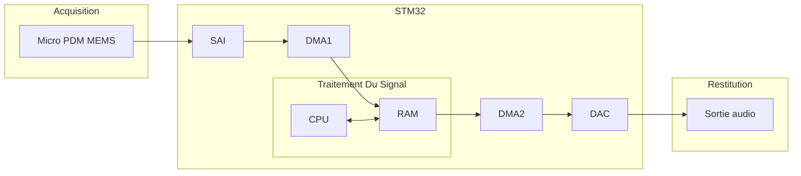

> Baptiste LE ROUX - Melvin DUBEE - Tanguy ROUDAUT

# Présentation

## Explication du projet

Au cours des 30 créneaux dédiés au projet il nous a été demandé de réussir à enregistrer un son de quelques secondes sur la carte STM32 fournie via un micro MEMS et le rejouer sur des hauts-parleurs via le DAC.

Pour nous organiser et avancer progressivement vers le résultat final, nous avons commencé par apprendre les bases, que ce soit sur la configuration de la carte STM32, l'utilisation de composants comme le DMA, le DAC etc, ou encore l'utilisation de GIT pour certains membres du groupe.

Nous avons illustré notre apprentissage dans la rubrique [Exemples](#exemples), comme allumer une LED, afficher un message dans le moniteur série avec l'UART, générer un signal en sortie avec le DAC...

Après avoir atteint une certaine maitrises de ces différents aspects nous avons mis bout à bout nos connaissances en produisant la chaine complète du projet ci-dessous :

Vue schématique du projet:

## Matériel

Pour mener à bien ce projet, nous avons utilisé une carte STM32F4290I-DISC1, un micro PDM, une sortie Jack, un casque, et le logiciel STM32CubeIDE.

## Utilisation

Pour tester le projet, vous aurez besoin du materiel cité précédemment. Suivez les instructions suivantes :

- Connectez la carte STM32 à votre pc via le periphérique ST-Link et lancer le logiciel STM32CubeIDE.
- Ouvrez le projet récupérable sur le git et flashez la carte avec le code main.c
- Connectez le haut parleur ou le casque audio sur les pin.
- Appuyez sur le bouton noir pour lancer/recommencer l'enregistrement, puis appuyez sur le bouton bleu pour le jouer.
